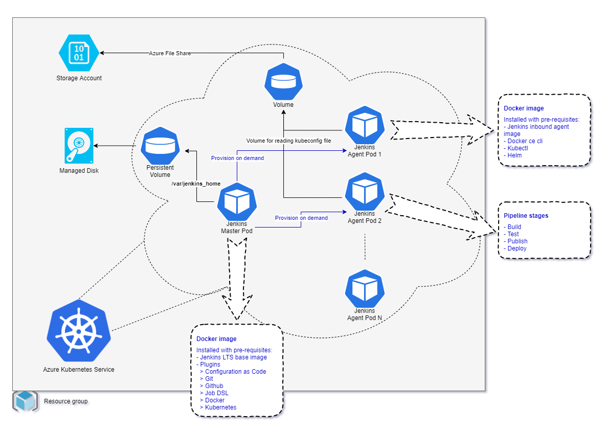

# fortio
CI/CD extension for kubernetes.


## Deployment architecture

This kubernetes extension has the following deployment topology:



* [Azure Kubernetes Service](https://docs.microsoft.com/en-us/azure/aks/) for running Jenkins.
* Storage
  * [Storage Account](https://docs.microsoft.com/en-us/azure/storage/common/storage-account-overview) for storing and retrieving kubeconfig files in Azure file share.
  * [Managed Disks](https://docs.microsoft.com/en-us/azure/virtual-machines/windows/managed-disks-overview) for storing Jenkins home directory.


## Install basic, docker, kubectl and helm pre-requisites
---
### - Update and upgrade apt packages:
``` SH
sudo apt-get update
sudo apt-get full-upgrade -y
```

### - Install basic prereuisites:
``` SH
sudo apt-get install -y \
     apt-transport-https \
     ca-certificates \
     curl wget unzip tar openssl git ssh nano \
     lsb-release \
     gnupg-agent gnupg2 \
     software-properties-common
```

### - Install docker ce for Ubuntu 18.04:
``` SH
curl -fsSL "https://download.docker.com/linux/$(lsb_release -is | tr -td '\n' | tr [:upper:] [:lower:])/gpg" | sudo apt-key add -

echo "deb [arch=amd64] https://download.docker.com/linux/$(lsb_release -is | tr -td '\n' | tr [:upper:] [:lower:]) \
$(lsb_release -cs | tr -td '\n' | tr [:upper:] [:lower:]) stable" | sudo tee -a /etc/apt/sources.list.d/docker.list

sudo apt-get update
sudo apt-get install -y docker-ce docker-ce-cli containerd.io
```

### - Install docker for Ubuntu 20.04:
``` SH
sudo apt-get install docker-compose
```

### - Install kubectl for Ubuntu 18.04:
``` SH
sudo apt-get update && sudo apt-get install -y apt-transport-https gnupg2
curl -s https://packages.cloud.google.com/apt/doc/apt-key.gpg | sudo apt-key add -
echo "deb https://apt.kubernetes.io/ kubernetes-xenial main" | sudo tee -a /etc/apt/sources.list.d/kubernetes.list
sudo apt-get update
sudo apt-get install -y kubectl
```

### - Install kubectl for Ubuntu 20.04:
``` SH
snap install kubectl --classic
```

### - Install helm
``` SH
curl -fsSL https://raw.githubusercontent.com/helm/helm/master/scripts/get-helm-3 | sudo bash -
```

### - Verify helm installation
``` SH
helm version
```

---

## Automatic installation of jenkins on kubernetes
* Option 1: Deploy azure kubernetes cluster (aks) and related resources by following the instructions in [infra/README.md](infra/README.md)
* Option 2: Or, bring your own kubernetes cluster along with a storage account and managed disk on which the aks identity has contributor permissions on them.
* Thereafter, follow these instructions:
``` SH
# change to the directory where you want fortio extension to be installed like, user's home (~)
cd ~

# preset sudo password in terminal session
sudo echo hi

# install the kubectl extension - fortio
# note: it will create a git clone directory - kubernetes-extension-fortio
curl https://raw.githubusercontent.com/ankursoni/kubernetes-extension-installers/master/fortio-installer.sh | sudo bash

# change the ownership of the git clone directory
sudo chown -R $USER: kubernetes-extension-fortio

# change directory to kubernetes-extension-fortio
cd kubernetes-extension-fortio

# prepare the auto setup script secret variables file - auto-setup-vars-secret
cp auto-setup-vars auto-setup-vars-secret

# update the secret variables file like the following, where,
# - FORTIO_GIT_CLONE_PATH is the local path for this cloned git repository
# - GITHUB_ORG is your github org that contains all your projects for ci/cd requirement
# - INIT_REPO is the git repository in your github org for the initial jenkins job creation pipeline
# - MANAGED_DISK_RG is the resource group of managed disk of a minimum 16GB capacity
# - AKS_RG is the resource group of azure kubernetes service
FORTIO_GIT_CLONE_PATH="/home/ankur/repo/kubernetes-extension-fortio"
CONTAINER_REGISTRY_URL="docker.io"
CONTAINER_REPOSITORY_NAME="ankursoni"
JENKINS_IMAGE_NAME="fortio"
GITHUB_USER_NAME="ankursoni"
GITHUB_USER_PAT="<removed as secret>"
GITHUB_ORG="BulldozerLabs"
INIT_REPO="kubernetes-extension-fortio"
ENABLE_LOCAL_DOCKER=false
CICD_NAMESPACE="jenkins"
CONTAINER_REGISTRY_USER_NAME="ankursoni"
CONTAINER_REGISTRY_USER_PASSWORD="<removed as secret>"
STORAGE_ACCOUNT_NAME="fortiodemosa01"
MANAGED_DISK_RG="fortio-demo-rg01"
MANAGED_DISK_NAME="fortio-demo-md01"
SUBSCRIPTION_ID="794a7d2a-565a-4ebd-8dd9-0439763e6b55"
AKS_NAME="fortio-demo-aks01"
AKS_RG="fortio-demo-rg01"

# execute jenkins installation
kubectl fortio auto-setup-vars-secret
```

---

## Build jenkins docker images and run locally

* Build jenkins agent docker image by following the instructions in [jenkins/agent/README.md](jenkins/agent/README.md)
* Build jenkins master docker image and run locally by following the instructions in [jenkins/master/README.md](jenkins/master/README.md)


## Deploy to azure kubernetes service cluster manually

* Deploy azure kubernetes cluster and related resources by following the instructions in [infra/README.md](infra/README.md)
* Build and publish jenkins agent docker image by following the instructions in [jenkins/agent/README.md](jenkins/agent/README.md)
* Build and publish jenkins master docker image by following the instructions in [jenkins/master/README.md](jenkins/master/README.md)
> NOTE: make sure the value for the variable - ENABLE_LOCAL_DOCKER is set to 'false' in the file - jenkins/master/jenkins-vars-secret
* Deploy jenkins master pod and services by following the instructions in [jenkins/master/helm/README.md](jenkins/master/helm/README.md)