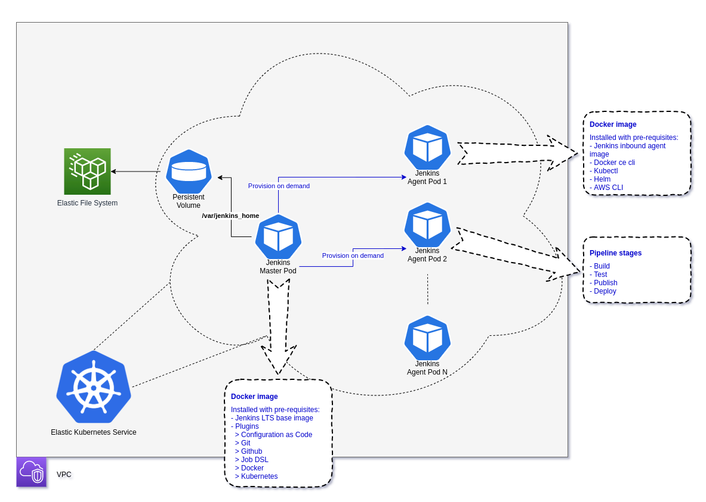
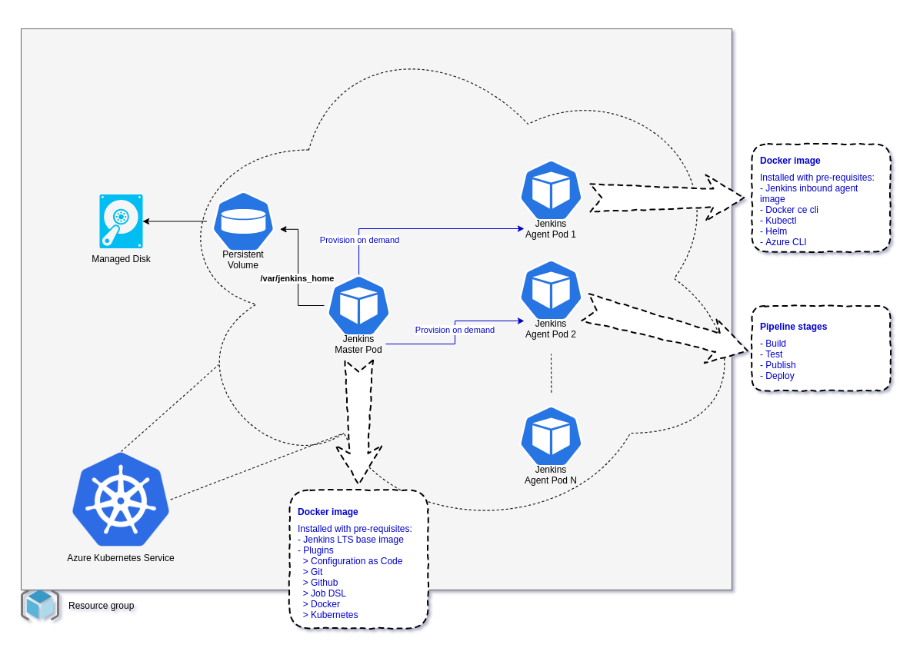

# fortosi
CI/CD extension for kubernetes.


## Deployment architecture

This kubernetes extension has the following deployment topology in AWS:



* [Elastic Kubernetes Service (EKS)](https://aws.amazon.com/eks/) for running Jenkins and [Fargate Node Profile](https://docs.aws.amazon.com/eks/latest/userguide/fargate.html) for running application pods.
* Storage
  * [Elastic File System (EFS)](https://aws.amazon.com/efs/) for storing Jenkins home directory.
> NOTE: EKS with Fargate is available only in selected regions: https://docs.aws.amazon.com/eks/latest/userguide/fargate.html


This kubernetes extension has the following deployment topology in Azure:



* [Azure Kubernetes Service (AKS)](https://docs.microsoft.com/en-us/azure/aks/) for running Jenkins and application pods.
* Storage
  * [Managed Disks](https://docs.microsoft.com/en-us/azure/virtual-machines/windows/managed-disks-overview) for storing Jenkins home directory.


## Install basic, docker, kubectl, helm and cloud pre-requisites on Windows Subsystem for Linux (WSL2) or Ubuntu
---
### - Update and upgrade apt packages:
``` SH
sudo apt-get update
sudo apt-get full-upgrade -y
```

### - Install basic prereuisites:
``` SH
sudo apt-get install -y \
     apt-transport-https \
     ca-certificates \
     curl wget unzip tar openssl git ssh nano \
     lsb-release \
     gnupg-agent gnupg2 \
     software-properties-common
```

### - Install yq:
``` SH
sudo add-apt-repository ppa:rmescandon/yq
sudo apt update
sudo apt install yq -y
```

### - Install docker ce:
``` SH
curl -fsSL "https://download.docker.com/linux/$(lsb_release -is | tr -td '\n' | tr [:upper:] [:lower:])/gpg" | sudo apt-key add -

echo "deb [arch=amd64] https://download.docker.com/linux/$(lsb_release -is | tr -td '\n' | tr [:upper:] [:lower:]) \
$(lsb_release -cs | tr -td '\n' | tr [:upper:] [:lower:]) stable" | sudo tee -a /etc/apt/sources.list.d/docker.list

sudo apt-get update
sudo apt-get install -y docker-ce docker-ce-cli containerd.io
```

### - Install kubectl:
``` SH
sudo apt-get update && sudo apt-get install -y apt-transport-https gnupg2
curl -s https://packages.cloud.google.com/apt/doc/apt-key.gpg | sudo apt-key add -
echo "deb https://apt.kubernetes.io/ kubernetes-xenial main" | sudo tee -a /etc/apt/sources.list.d/kubernetes.list
sudo apt-get update
sudo apt-get install -y kubectl
```

### - Install helm:
``` SH
curl -fsSL https://raw.githubusercontent.com/helm/helm/master/scripts/get-helm-3 | sudo bash -

# verify
helm version
```

---
### - Install aws tools:
``` SH
# install aws cli
curl "https://awscli.amazonaws.com/awscli-exe-linux-x86_64.zip" -o "awscliv2.zip"
unzip awscliv2.zip
sudo ./aws/install
rm -rf ./aws awscliv2.zip
```

Or,

### - Install azure tools:
``` SH
# install azure cli
curl -sL https://aka.ms/InstallAzureCLIDeb | sudo bash
```
---

## Automatic installation of jenkins on kubernetes
* Option 1: Deploy cloud kubernetes cluster and related resources by following the instructions in [infra/aws/README.md](infra/aws/README.md) or [infra/azure/README.md](infra/azure/README.md)
* Option 2: Or, bring your own elastic kubernetes service cluster along with an elastic file system having the access point in the same VPC as EKS.
* Option 3: Or, bring your own azure kubernetes service cluster along with a managed disk on which the aks identity has contributor permissions.
* Thereafter, follow these instructions:
``` SH
# change to the directory where you want fortosi extension to be installed like, user's home (~)
cd ~

# preset sudo password in terminal session
sudo echo hi

# install the kubectl extension - fortosi
# note: it will create a git clone directory - kubernetes-extension-fortosi
curl https://raw.githubusercontent.com/ankursoni/kubernetes-extension-installers/master/fortosi-installer.sh | sudo bash

# change the ownership of the git clone directory
sudo chown -R $USER: kubernetes-extension-fortosi

# change directory to kubernetes-extension-fortosi
cd kubernetes-extension-fortosi

# prepare the auto setup script secret variables file - auto-setup-vars-secret
cp auto-setup-vars auto-setup-vars-secret

# update the secret variables file like the following, where,
# - FORTOSI_GIT_CLONE_PATH is the local path for this cloned git repository
# - GITHUB_ORG is your github org that contains all your projects for ci/cd requirement
# - INIT_REPO is the git repository in your github org for the initial jenkins job creation pipeline
# - AZURE_MANAGED_DISK_RG is the azure resource group of managed disk of a minimum 16GB capacity
# - AZURE_AKS_RG is the azure resource group of azure kubernetes service
# - CLOUD_PROVIDER is the either aws or azure
FORTOSI_GIT_CLONE_PATH="/home/ankur/repo/kubernetes-extension-fortosi"
CONTAINER_REGISTRY_URL="docker.io"
CONTAINER_REPOSITORY_NAME="ankursoni"
JENKINS_IMAGE_NAME="fortosi"
GITHUB_USER_NAME="ankursoni"
GITHUB_USER_PAT="<removed as secret>"
GITHUB_ORG="ankursoni"
INIT_REPO="kubernetes-extension-fortosi"
ENABLE_LOCAL_DOCKER=false
CICD_NAMESPACE="jenkins"
CONTAINER_REGISTRY_USER_NAME="ankursoni"
CONTAINER_REGISTRY_USER_PASSWORD="<removed as secret>"
AWS_REGION_CODE="ap-southeast-2"
AWS_EKS_NAME="fortosi-demo-eks01"
AWS_EFS_ID="<removed as secret>"
AZURE_MANAGED_DISK_RG="fortosi-demo-rg01"
AZURE_MANAGED_DISK_NAME="fortosi-demo-md01"
AZURE_SUBSCRIPTION_ID="794a7d2a-565a-4ebd-8dd9-0439763e6b55"
AZURE_AKS_NAME="fortosi-demo-aks01"
AZURE_AKS_RG="fortosi-demo-rg01"
CLOUD_PROVIDER="aws"

# execute jenkins installation
kubectl fortosi auto-setup-vars-secret

# access jenkins portal by browsing http://localhost:8090
```

---

## Build jenkins docker images and run locally

* Build jenkins agent docker image by following the instructions in [jenkins/agent/README.md](jenkins/agent/README.md)
* Build jenkins master docker image and run locally by following the instructions in [jenkins/master/README.md](jenkins/master/README.md)


## Deploy to azure kubernetes service cluster manually

* Deploy azure kubernetes cluster and related resources by following the instructions in [infra/azure/README.md](infra/azure/README.md)
* Build and publish jenkins agent docker image by following the instructions in [jenkins/agent/README.md](jenkins/agent/README.md)
* Build and publish jenkins master docker image by following the instructions in [jenkins/master/README.md](jenkins/master/README.md)
> NOTE: make sure the value for the variable - ENABLE_LOCAL_DOCKER is set to 'false' in the file - jenkins/master/jenkins-vars-secret
* Deploy jenkins master pod and services by following the instructions in [jenkins/master/helm/README.md](jenkins/master/helm/README.md)